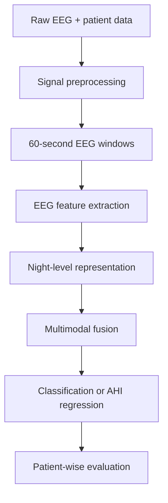

# Predicting Sleep Apnea from Polysomnography

A multimodal machine-learning study that combines overnight EEG recordings with patient-level physiological data to predict obstructive sleep apnea severity.

The project investigates both classification and regression formulations, compares several EEG representations, and evaluates models ranging from regularized logistic regression to attention-based neural networks. A central goal is to understand what can be learned reliably from a small, imbalanced clinical dataset without leaking patient-specific information across training and evaluation sets.

## Research question

Can sleep apnea severity be predicted from six-channel overnight EEG recordings together with physiological patient information?

We study two related formulations:

- **Classification:** directly predict an apnea-severity category.
- **Regression:** predict the Apnea-Hypopnea Index (AHI), then map the result to a severity category.

AHI is the number of apnea and hypopnea events per hour of sleep:

$$
\mathrm{AHI} = \frac{N_{\mathrm{apnea}} + N_{\mathrm{hypopnea}}}{\mathrm{recording\ time\ in\ hours}}
$$

## Dataset

The analysis uses the [Polysomnographic sleep data](https://www.kaggle.com/datasets/yfrite/polysom) dataset.

- 40 patients, with up to two recorded nights per patient
- 80 recordings initially; 2 recordings removed because of severe artifacts
- approximately 8 hours of EEG per recording, sampled at 200 Hz
- six EEG channels: `Fp1-M2`, `C3-M2`, `O1-M2`, `Fp2-M1`, `C4-M1`, and `O2-M1`
- patient and night-level variables such as age, sex, height, weight, pulse, blood pressure, oxygen desaturation index (ODI), apnea index (AI), hypopnea index (HI), and AHI

For the main three-class experiments, the original mild and moderate groups are merged:

| Class | AHI range |
| --- | ---: |
| Healthy / asymptomatic | `< 5` |
| Mild-moderate | `5-29` |
| Severe | `>= 30` |

## Main challenges

- **Very small sample size:** only 78 usable nights are available.
- **High dimensionality:** one night contains millions of EEG samples for a single global label.
- **Class imbalance:** observations are concentrated around healthy and severe cases.
- **Repeated patients:** two nights from the same patient are strongly related and must never be split across training and test data.
- **Weak supervision:** AHI is provided at the night level, not for individual 60-second windows.
- **Multimodal fusion:** EEG-derived features and patient-level physiological variables have different scales and structures.

## Pipeline

### 1. EEG preprocessing

The recordings are cleaned using:

- a 50 Hz notch filter to remove power-line interference;
- a 1-50 Hz band-pass filter to suppress baseline drift and high-frequency noise;
- Independent Component Analysis (ICA) to reduce ocular, cardiac, and muscular artifacts;
- segmentation into 60-second epochs.

### 2. EEG representations

Several representations are compared:

- **Raw spectral power:** power spectral density is integrated over physiologically meaningful frequency bands for every channel and time window.
- **Wavelet features:** a Daubechies-4 discrete wavelet transform produces multiresolution subbands; energy, mean absolute value, and standard deviation summarize each subband.
- **Power FPCA:** Functional Principal Component Analysis describes the temporal evolution of band power across the night.
- **Hybrid embeddings:** window-level statistics and physiologically motivated features are aggregated into fixed-length night representations.

PCA and UMAP are used as exploratory tools to assess whether the representations preserve severity-related structure. Wavelet and raw-power features appear more informative than the FPCA representation for this dataset.

### 3. Leakage-safe multimodal modeling

EEG embeddings are concatenated with patient-level physiological features. All learned preprocessing operations - including scaling, PCA, feature selection, and any data-dependent embedding transformation - are fitted on the training fold only.

Splits are performed at the **patient level**, ensuring that all nights belonging to one patient remain in the same fold. This prevents the model from exploiting patient-specific patterns and producing overoptimistic results.

## Models explored

### Classification

- multinomial logistic regression with L1 regularization;
- two-stage ordinal classification using the thresholds `AHI >= 5` and `AHI >= 30`;
- PCA followed by logistic regression;
- random forest classification.

### Regression

- gradient boosting regression to predict AHI, followed by clinical thresholding.

### Neural architecture

An attention-based multimodal network is also explored. It:

1. embeds each EEG window;
2. learns attention weights over the sequence of windows;
3. computes a weighted night-level EEG representation;
4. embeds the patient-level variables;
5. combines both representations in a shared backbone;
6. uses separate heads for apnea classification and AHI regression.

L1 regularization and dropout are used to limit overfitting. Because the dataset contains only 78 usable recordings, the neural results are treated as exploratory rather than clinically conclusive.

## Evaluation

The evaluation emphasizes metrics that remain informative under class imbalance:

- macro F1 score;
- per-class precision, recall, and F1 score;
- one-vs-rest ROC-AUC;
- confusion matrices;
- regression residual analysis;
- nested or patient-grouped cross-validation for model selection and evaluation.

## Results and observations

The main experimental findings are:

- **Healthy subjects are consistently the easiest to recognize.**
- **The middle severity group is the most difficult**, because it overlaps with both healthy and severe cases.
- The direct L1-logistic model achieved one-vs-rest AUC values of **0.95**, **0.67**, and **0.75** for healthy, mild-moderate, and severe cases, respectively.
- PCA improved the balance of the middle class in some folds, but performance remained highly variable because of the low sample size and multicollinearity.
- The random forest produced the strongest class separation among the classical classifiers, with one-vs-rest AUC values of **0.99**, **0.86**, and **0.89**.
- Gradient boosting regression classified healthy subjects reasonably well, but often mapped moderate cases to the severe class and underestimated very high AHI values.
- The attention model provides interpretable saliency weights over time. High-attention windows correlate with changes in spectral centroid and low/high-frequency power ratio, suggesting that the model focuses on physiologically meaningful EEG patterns.

These results should be interpreted cautiously: the number of independent patients is small, and uncertainty across folds is substantial.

## Key conclusions

1. Patient-wise splitting is essential; sample-wise splitting would leak patient identity.
2. EEG representations based on spectral power and wavelets are more promising than FPCA in this setting.
3. Random forests are comparatively robust for the available sample size, although the mild-moderate class remains challenging.
4. Direct AHI regression is unstable near severity thresholds and at the high end of the target distribution.
5. Attention-based networks are attractive because they preserve temporal structure and offer window-level interpretability, but substantially more data is needed for reliable generalization.

## Limitations

- only 40 patients and 78 usable nights;
- strong class imbalance and an unusual concentration of healthy observations at `AHI = 0`;
- one global label for an entire night, with no event-level annotations;
- results are sensitive to the patient composition of each fold;
- EEG alone may not contain all information required for reliable apnea diagnosis;
- no external clinical cohort was available for validation.

## Future work

- validate the pipeline on a larger, independent cohort;
- add event-level apnea and hypopnea annotations;
- incorporate additional polysomnographic signals such as oxygen saturation, airflow, respiratory effort, ECG, and EOG;
- investigate class-balanced losses and calibrated ordinal models;
- use self-supervised pretraining on unlabeled EEG recordings;
- model spatial relationships between electrodes and temporal relationships between windows explicitly;
- quantify predictive uncertainty and assess calibration before any clinical use.

## Team

- Matteo Piacentini
- Tommaso Viganò
- Lorenzo Zani

## References

1. A. Subasi and E. Ercelebi, *Classification of EEG signals using neural network and logistic regression*.
2. A. S. Al-Fahoum and A. A. Al-Fraihat, *Methods of EEG Signal Features Extraction Using Linear Analysis in Frequency and Time-Frequency Domains*.

## Disclaimer

This project is an academic machine-learning study. It is not a medical device and must not be used for diagnosis or treatment decisions.
